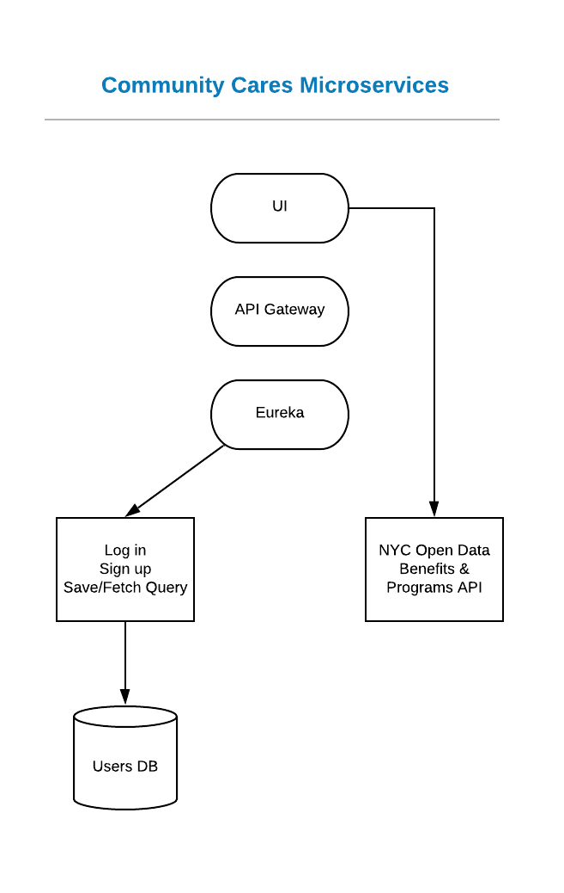
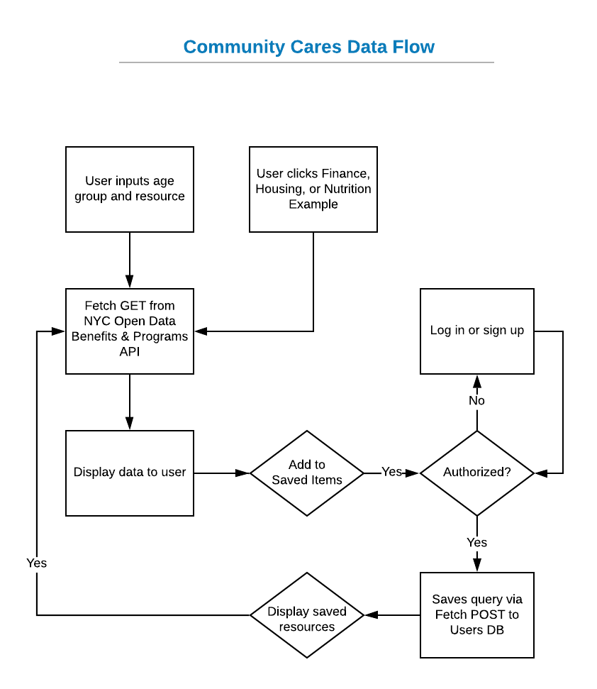
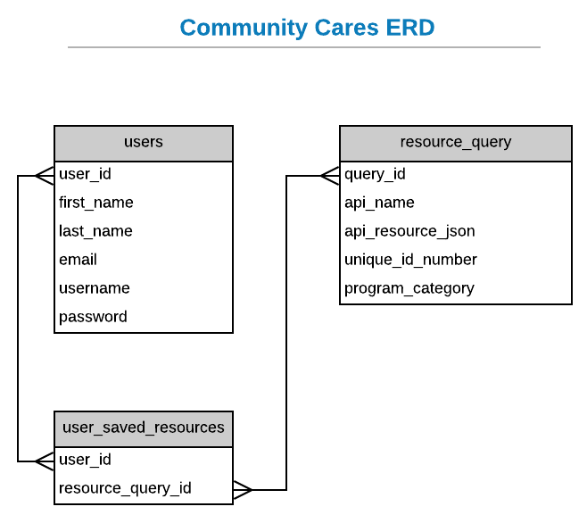
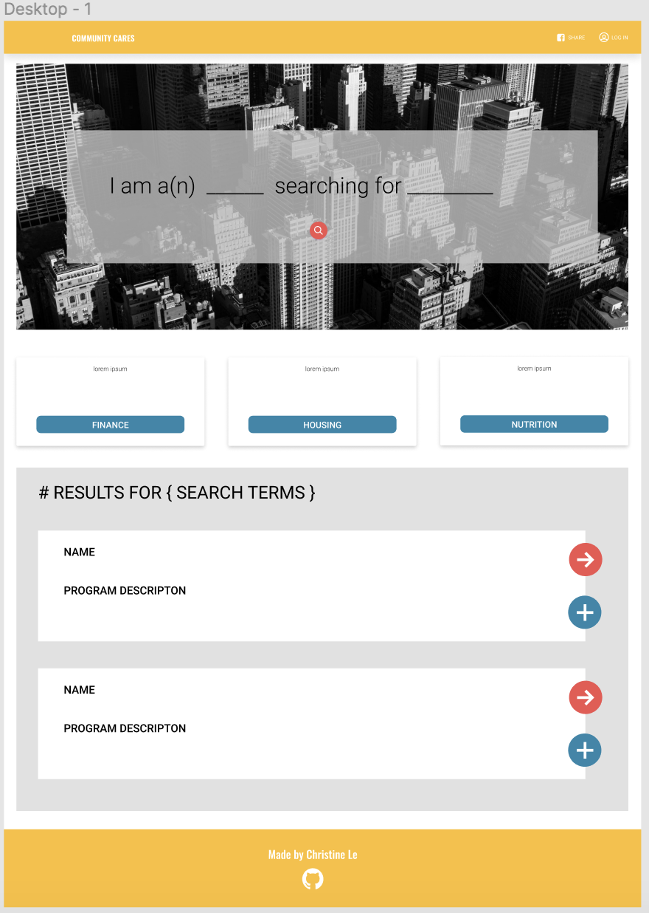

### community-cares
Community Cares aims to foster the relationship between people and government. Based on user's query, it delivers information about free resources in New York City.

See it live: <a href="http://community-cares-deploy.s3-website-us-east-1.amazonaws.com/" target="_blank">Community Cares hosted on AWS</a>

### Technologies
Application: 
- Java Spring Boot
- React
- PostgreSQL
- API: <a href = "https://data.cityofnewyork.us/Social-Services/Benefits-and-Programs-API/kvhd-5fmu" target="_blank">NYC Open Data Benefits and Programs API</a>

Deployment:
- Docker 
- Netflix Eureka & Zuul
- AWS EC2 & S3

Planning:
- Figma
- Trello
- Lucidchart

### General approach
Although it was not a project requirement, I wanted to incorporate a 3rd party API into this project. I am passionate about bringing tech into spaces often overlooked, and using data to help people make informed decisions. Naturally this led me to use NYC Open Data's Program and Benefits API, which provides benefit, program, and resource information for over 80 health and human services available to NYC residents. I chose this data set because it provides applicable information to a large population, and the data is kept up-to-date and includes the most recent applications, eligibility requirements, and application dates. Users would be able to interact with this API via Community Cares to perform individual queries that filter by age group and program type. I researched how to access the data via Socrata Open Data API via SoQL Queries (“Socrata Query Language”). After, I built the Java Spring Boot microservices (Eureka, Zuul Gateway, User's API) and built my front-end with the wireframe as a reference.

### Wireframes and Planning

### Unsolved problems
- Security - handling persistent user logged-in from the back-end or persist state (with token), rather than using localStorage.
- As soon as user is logged in, view resources is not ready. 

### User stories
- As a user, I want to query searches to find resources applicable to me.
- As a user, I want to save resources to view later.
- As a user, I want to delete resources from my saved list if they are no longer applicable to me.
